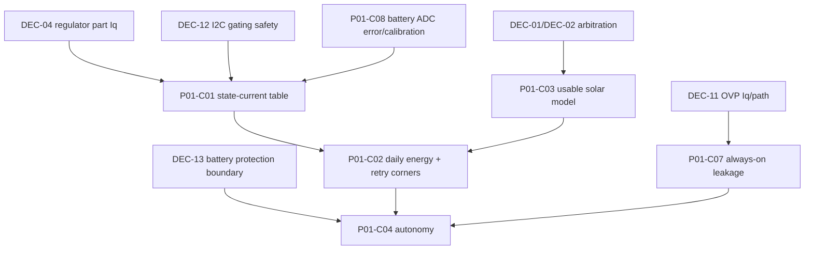

# PROJECT-01 Scenario Closure Path for GATE-2 (P01-UC01..07)

Purpose: map each mandatory operational scenario to explicit blockers, calculation packages, and decisions so GATE-2 can be moved from `BLOCKED` to **PASSABLE** (path clear, not fully closed).

## 1) Scenario-to-blocker matrix (mechanically traceable)

| Scenario | Core dependency decisions | Required calculation packages | Current blockers | Closure criteria (evidence package) | Pre-schematic priority |
|---|---|---|---|---|---|
| **P01-UC01 NORMAL_SOLAR** | DEC-01, DEC-02, DEC-07 | P01-C03 (+ P01-C02 for retry-energy corners) | DEC-01/02 are `RESEARCH_REQUIRED`; solar model package not started | Frozen source-state arbitration table (USB/solar/both/neither + transitions), selected arbitration path with losses/Iq, solar usable-energy model tied to duty-cycle/wake assumptions | **MUST** |
| **P01-UC02 NIGHT_BATTERY** | DEC-13, DEC-04(part), DEC-07 | P01-C01, P01-C04, P01-C07 | DEC-13 is `RESEARCH_REQUIRED`; regulator part for DEC-04 still open; autonomy package not started | Frozen protected-cell boundary/cutoff inputs, complete state-current rows (including critical-battery row), validated no-solar autonomy outputs (nominal + worst case) | **MUST** |
| **P01-UC03 LOW_SOLAR** | DEC-13 + new low-SOC behavior decision (linked to SOL-016) | P01-C02, P01-C03, P01-C04 | No frozen low-SOC policy; energy model packages open | Explicit low-solar policy threshold/behavior, daily energy deficit model with retry corners, autonomy impact against selected battery boundary | SHOULD (can defer if guardrails defined) |
| **P01-UC04 WIFI_UNAVAILABLE** | **New decision required** (Wi-Fi retry/backoff/data policy; distinct from DEC-09 sensor faults) | P01-C02 (retry corners), P01-C01 active-state split | No Wi-Fi-specific retry/backoff/data-retention decision; daily retry-energy package open | Bounded Wi-Fi retry/backoff and unsent-telemetry policy, retry-corner energy budget proving no destabilization of sleep-dominant envelope | SHOULD (can defer if conservative fallback fixed) |
| **P01-UC05 CRITICAL_BATTERY** | DEC-13 + firmware threshold decision alignment | P01-C01 (critical-battery row), P01-C04 | Threshold currently assumed (~3.4 V) not frozen by real cell/protection evidence | Frozen trigger threshold from selected battery protection boundary, degraded-mode current row, autonomy impact from threshold to protection cutoff | SHOULD (close with UC02 data set) |
| **P01-UC06 USB_MAINTENANCE** | DEC-01, DEC-02 | P01-C01 (USB-present row), P01-C03 (if solar simultaneously present) | Same unresolved arbitration evidence as UC01 | Source-priority + reverse-current behavior table with insertion/removal transitions and no-backfeed evidence; USB-present energy/current row | **MUST** |
| **P01-UC07 RECOVERY** | **New decision required** (brownout/depletion recovery state/entry-exit) + DEC-07/DEC-09 interplay | P01-C01 (recovery row), P01-C02 (retry after recovery) | Recovery state not defined in current state model; no decision ID yet | Added recovery-state contract (entry, safe outputs, exit criteria), current/energy row for recovery cycles, bounded restart/retry behavior | CAN_DEFER (but must be tracked before implementation freeze) |

## 2) Calculation package dependency graph (P01-C01..08)

### Package-level blocker map

| Package | Required inputs (decisions/datasheets) | Formula / structure (expected) | Output / verification target | Blocking status |
|---|---|---|---|---|
| **P01-C01** state-current table | DEC-04 part Iq, DEC-12 chosen gating behavior, DEC-13 thresholds, charger/arbitration own-current terms | Row-wise current model by state (sleep/measure/CPU/Wi-Fi TX-RX/USB-present/critical/recovery) | Per-state currents and weighted cycle terms feeding daily model | **PARTIAL + BLOCKED by DEC-04 part, DEC-12, DEC-13** |
| **P01-C02** daily energy + retry corners | P01-C01 rows, Wi-Fi retry policy decision (new), duty-cycle assumptions, solar inputs from C03 | Time-weighted mAh/mWh/day including retry corner cases | Energy-neutral/surplus/deficit determination under fault corners | **OPEN** |
| **P01-C03** usable solar-energy model | DEC-01/02 arbitration path, panel envelope (VOC/VMP/IMP), charger-path assumptions | Effective harvested energy model across source/efficiency corners | Usable daily harvest bounds for UC01/03/06 | **OPEN (blocked by DEC-01/02 freeze)** |
| **P01-C04** autonomy | Battery usable window (DEC-13), consumption (C01/C02), always-on leakage (C07) | Autonomy hours/days under nominal + worst no-solar conditions | UC02/05 closure evidence | **OPEN** |
| **P01-C05** charger thermal/input/recharge | Charger decision baseline + panel/input constraints (PR#2 batch-8 charger swap evidence included) | Input/thermal/recharge-time consistency analysis | Charger operating safety margin + recharge-time envelope | **OPEN** |
| **P01-C06** 3.3V regulator peak/transient/stability | Final DEC-04 part selection and ESP32 load profile | Peak/transient/stability margin checks for selected rail component | Regulator adequacy evidence for active + transient loads | **OPEN (blocked by DEC-04 part)** |
| **P01-C07** always-on leakage budget | DEC-11 OVP Iq, DEC-04 part Iq, arbitration-path own-current terms | Sum of always-on leakage contributors in sleep-dominant mode | Closed sleep-current leakage total with no OPEN term | **PARTIAL (OPEN terms remain)** |
| **P01-C08** battery ADC budget | DEC-05 topology (already candidate), ADC/filter/source-impedance/calibration assumptions | Divider/filter/ADC-error propagation and calibration budget | Battery threshold confidence bounds for UC05 decisions | **PARTIAL (leakage-only subpart done)** |

## 3) Decision dependency table and closure critical path

| Decision | Current status | Depends on | Unblocks | Evidence source now | Resolution order |
|---|---|---|---|---|---|
| DEC-01 Solar topology | `RESEARCH_REQUIRED` | P01-R01 research package | UC01/UC06, C03 | `06_decisions/decision_register.md` | 1 |
| DEC-02 USB-vs-solar arbitration | `RESEARCH_REQUIRED` | P01-R01 research package | UC01/UC06, C03 | `06_decisions/decision_register.md` | 1 |
| DEC-03 Charger IC | `DECIDED (candidate)` baseline; PR#2 batch-8 adds charger-swap rationale evidence | Upstream arbitration assumptions | C05 consistency | decision register + PR#2 batch 8 notes | 2 (confirm consistency) |
| DEC-04 Regulator topology/part | topology decided, part open (`RESEARCH_REQUIRED`) | P01-R03 part-selection research | C01/C06/C07, UC02 | `06_decisions/decision_register.md` | 2 |
| DEC-05 Battery divider gating | `DECIDED (candidate)` | — | C08 leakage subpart | decision register | keep |
| DEC-06 Sensor selection | `DECIDED (candidate)` | — | SOL-006/010 baseline | decision register | keep |
| DEC-07 Wake trigger | `DECIDED (candidate)` | — | UC01/UC02 timing assumptions | decision register | keep |
| DEC-08 Duplicate-address handling | `DECIDED (candidate)` (`NOT_APPLICABLE`) | DEC-06 remains valid | no direct GATE-2 blocker | decision register | keep |
| DEC-09 Fault escalation | `DECIDED (candidate)` (sensor-fault scope) | — | Recovery/Wi-Fi policy alignment | decision register | 4 (alignment only) |
| DEC-10 PCB stackup | `OPEN (deferred)` | post-GATE-2 stage | not on GATE-2 critical path | decision register | defer |
| DEC-11 Input OVP | `BLOCKED` | P01-R06 research package | C07 leakage closure, input safety envelope | decision register | 3 |
| DEC-12 BME280 gating logic safety | `OPEN` | P01-R05 research package | C01 correctness, hardware-safety readiness | decision register + I2C contract | 2 (must precede schematic) |
| DEC-13 Battery protection boundary | `RESEARCH_REQUIRED` | P01-R04 research package | UC02/UC05, C01/C04 | decision register | 2 |

### Must-have vs nice-to-have for **GATE-2 PASSABLE**

- **Must-have before schematic start:** DEC-01, DEC-02, DEC-04(part), DEC-12, DEC-13, plus enough C01/C02/C03/C04/C07 completion to remove OPEN terms from gating calculations.
- **Strongly recommended in same wave:** DEC-11 (input safety + leakage closure).
- **Can defer (tracked):** UC07 detailed recovery optimization, UC04 policy tuning refinements, DEC-10 implementation-stage layout specifics.

## 4) Research handoff specification (compact return contract)

Research session must return a **closure-ready package** for each blocker:

| Package | Must return (minimum) | Accept/reject check |
|---|---|---|
| **P01-R01** (DEC-01/02) | 2–3 candidate arbitration comparison, source-state/transition table, reverse-current/no-backfeed behavior, own-current terms and efficiency/loss assumptions | Single selected architecture + explicit rejected alternatives + values consumable by C03/C07 |
| **P01-R03** (DEC-04 part) | Specific ≥500 mA regulator part, IQ + key operating parameters under relevant conditions, rationale vs alternatives | `I_regulator_iq` no longer OPEN; C01/C06 runnable |
| **P01-R04** (DEC-13) | Protected-cell boundary vs standalone protection comparison, selected boundary, cutoff/leakage/failure assumptions from primary datasheet evidence | Frozen battery operating window/threshold inputs for C04/UC02/UC05 |
| **P01-R05** (DEC-12) | Chosen safe I2C power/gating policy (no VDDIO-off + pins-high hazard), updated interface behavior constraints, current impact terms | Hardware-safety hazard closed, C01 model row assumptions frozen |
| **P01-R06** (DEC-11) | OVP candidate selection with missing Iq/leakage evidence and trip/disconnect behavior fit for hot-plug use | DEC-11 no longer BLOCKED; C07 leakage term closed |

### PR #2 (batches 6–8): immediately usable vs handoff-needed

**Immediately usable now**
- Batch 6 structure: scenario/calculation framing and corrected analysis hygiene inputs.
- Batch 8 architecture finding: charger VIN conflict evidence and charger-change rationale as an input to C05/consistency checks.
- Candidate seeds from batch 7 are usable as **inputs**, not closures.

**Still needs research handoff closure**
- Any item currently marked `RESEARCH_REQUIRED`, `OPEN`, or `BLOCKED` in DEC-01/02/04(part)/11/12/13 and related P01-R01/03/04/05/06.

## 5) GATE-2 minimal closure criteria for **PASSABLE** status

GATE-2 is **PASSABLE** when all items below are true and auditable in-repo:

1. **Decision freeze set completed:** DEC-01, DEC-02, DEC-04(part), DEC-12, DEC-13 are no longer `RESEARCH_REQUIRED/OPEN`; DEC-11 is at least selected with evidence-backed parameters.
2. **Calculation minimum set completed:** C01, C02, C03, C04, C07 are numerically runnable with no OPEN gating term; C05/C06/C08 have bounded assumptions or completed analyses where required by chosen decisions.
3. **Scenario closure minimum:** UC01, UC02, UC06 marked closable with explicit evidence links; UC03/04/05/07 at minimum have frozen interim policies and tracked closure tasks.
4. **Traceability check passes:** each scenario row references concrete decision IDs + package outputs + evidence source paths.
5. **No hidden blocker:** any deferred item is explicitly marked non-critical-path for schematic-start and has an owner + return artifact definition.

This defines a minimum auditable path to proceed without claiming full GATE-2 closure.
